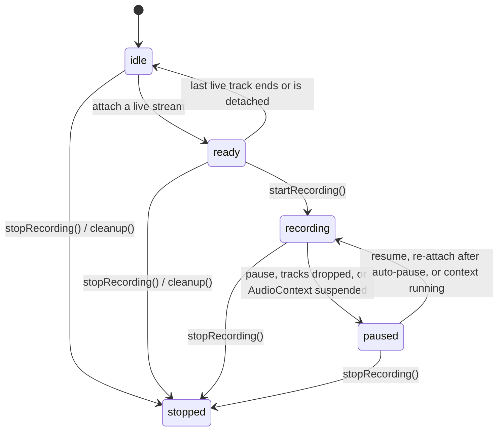

# streams-recorder

Browser audio recorder that mixes **multiple live `MediaStream`s** into one `MediaRecorder` timeline. Built for reliability: mute, unplug, and `AudioContext` interruptions should pause instead of writing empty chunks or getting stuck.

**[Try the live demo](https://vaibhav11s.github.io/streams-recorder/)** — mix your microphone with tab or system audio and download the result.

This is an early release for feedback. Please open [issues](https://github.com/vaibhav11s/streams-recorder/issues) with browser + OS details when something fails.

**Browser only.** There is no Node runtime.

## Install

```sh
pnpm add streams-recorder
```

```sh
npm install streams-recorder
```

## Usage

Acquire streams yourself (`getUserMedia`, `getDisplayMedia`, WebRTC, etc.), then attach them by key:

```ts
import { streamsRecorder } from 'streams-recorder'

const chunks: Blob[] = []

const recorder = streamsRecorder({
  onDataAvailable: event => chunks.push(event.data),
  onStateChange: state => console.log(state),
  onActiveSourcesChange: keys => console.log('live sources', keys),
  onError: (error, context) => console.error(error, context),
})

const mic = await navigator.mediaDevices.getUserMedia({ audio: true })
await recorder.changeSourceStream('mic', mic)

await recorder.startRecording() // timeslice defaults to 5000ms
// recorder.pauseRecording() / resumeRecording()
await recorder.stopRecording()

const blob = new Blob(chunks, { type: chunks[0]?.type ?? 'audio/webm' })
```

Add or replace sources at any time. Pass `null` to detach a key:

```ts
const display = await navigator.mediaDevices.getDisplayMedia({ video: true, audio: true })
await recorder.changeSourceStream('display', display)
await recorder.changeSourceStream('mic', null)
```

State machine:



`stopped` is terminal. Each instance is **single-use** — after `stopRecording()` or `cleanup()`, create a new one (in React/Vue, remount the component).

## Public API

| Member | Role |
| --- | --- |
| `streamsRecorder(options)` | Create a mixer + `MediaRecorder` on an `AudioContext` destination. |
| `changeSourceStream(key, stream \| null)` | Connect, replace, or detach a named input stream. |
| `startRecording(timeslice?)` | Start capturing; requires `ready` and at least one live track. |
| `pauseRecording()` / `resumeRecording()` | Pause/resume the recorder timeline. |
| `stopRecording()` | Stop and close the audio graph (stops input tracks unless `skipTrackStop`). |
| `cleanup()` | Tear down without requiring an active recording. |
| `getDurationMs()` | Elapsed recording time excluding pauses. |
| `recordingState` / `stream` / `audioContext` | Current state, mixed output stream, and context. |
| `getSupportedMimeType()` / `getRecorderMimeType()` | Pick a `MediaRecorder` mime the browser actually supports. |

### Reliability behavior

- **All tracks ended:** auto-pauses so the timeline does not keep emitting empty data; attaching a live stream can auto-resume. If nothing is recording, state drops from `ready` back to `idle`.
- **`AudioContext` suspended / interrupted:** auto-pause, then auto-resume when the context is `running` again (phone calls, tab freeze, iOS).
- **Mime fallback:** prefers `audio/webm;codecs=opus`, then Safari `audio/mp4`.

React and Vue helpers are optional subpath exports. Install the matching framework as a peer if you use them.

### React

```ts
import { useStreamsRecorder } from 'streams-recorder/react'

const { recordingState, changeSourceStream, startRecording, stopRecording, getDurationMs } = useStreamsRecorder({
  onDataAvailable: event => chunks.push(event.data),
})
```

The instance is created once per component mount. After `stopRecording()`, remount the component (for example `key={session}`) to get a new recorder. Duration is not tracked in the hook — call `getDurationMs()` yourself.

### Vue

```ts
import { useStreamsRecorder } from 'streams-recorder/vue'

const { recordingState, changeSourceStream, startRecording, stopRecording, getDurationMs } = useStreamsRecorder({
  onDataAvailable: event => chunks.push(event.data),
})
```

Same single-use rule: remount the component (`:key`) after stop. Poll `getDurationMs()` in the app if you need a timer.

## Examples

The React example is deployed at [vaibhav11s.github.io/streams-recorder](https://vaibhav11s.github.io/streams-recorder/). To run any of them locally, clone this repo, then:

```sh
pnpm install
pnpm dev:vanilla   # microphone + optional display audio, download on stop
pnpm dev:react     # same demo in React
pnpm dev:vue       # same demo in Vue, with a microphone device picker
```

The vanilla example is the easiest place to try multi-source mixing. React and Vue wrap the same recorder API.

## Feedback

Useful reports include: browser + version, OS, whether sources were mic / tab / system audio, and whether the failure was start, pause, device unplug, or backgrounding the tab.
